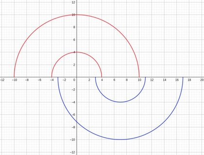
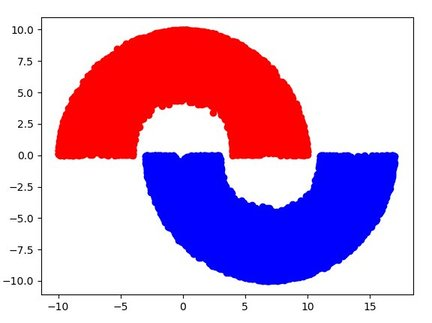

# Double Moon

The Double Moon experiment was first introduced on section 1.5 of Haykin's Neural Network book. It uses a Single Layer Perceptron with 2 inputs and 2 outputs.

## Plot

### Theory

This graph represents the lines that must contain all the points of each moon. Note that `w = 6`, `r = 4` and `d = 0` .

### Implementation

In order to get the points inside of each moon on Scala, I used `matplotlib` on Python to get the expressions, which are:
>

Where:
* `random` stands for a random number between 0 and 1, not the same.
* `a` stands for a random angle.
* `w` stands for width of the arch.
* `r` stands for the radius of the inner circle.
* `d` stands for vertical distance between both circles.

Note that `x1` and `y1` equations will give you random points on inside the blue-moon and the `x2` and `y2` equations will give you random points inside the red-moon. You can see it by running `python aux/plotter.py` .

Final result:

## Results
Using parameters `w = 6; r = 4; d = 0` (which was also used on the book) and `lr = 0.05`:
* 1,000 training samples:
	* about 1950 right answers out of 2,000 (~97%)
	* about 9850 right answers out of 10,000 (~98%)
* 5,000 training samples:
	* about 1980 right answers out of 2,000	(~99%)
	* about 9850 right answers out of 10,000 (~98%)
* 20,000 training samples:
	* about 1990 right answers out of 2000 (~99%)
	* about 9950 right answers out of 10,000 (~99%)
